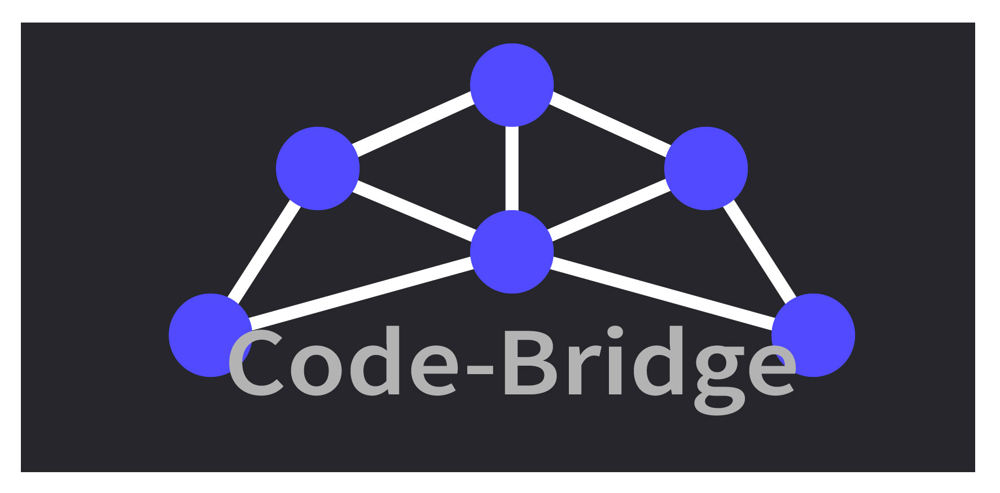

# CodeBridge



## 🌍 Breaking Language Barriers in Programming

Imagine having a brilliant idea for an app or an innovation that could change the world—only to be held back, not by your skills, but by language.

Every day, countless aspiring developers struggle—not due to a lack of talent, but because coding is dominated by English syntax, documentation, and communities. Error messages are cryptic, tutorials feel inaccessible, and asking for help becomes an uphill battle.

But programming isn’t about English—it’s about logic, creativity, and problem-solving. So why should language be a barrier?

**CodeBridge** is here to change that. We’re building a platform that **translates, teaches, and empowers** programmers in their native language, making coding accessible to everyone, everywhere.

---

## 🚀 Live Deployment

Check out CodeBridge live:

👉 [CodeBridge on Vercel](https://codebridge-css.vercel.app)

---

## 📂 Repository

Contribute or explore the code:

👉 [GitHub - CodeBridge](https://github.com/KGandhi90/Code-Bridge.git)

---

## 🔧 Features

- 🌎 **Multilingual Code Assistance** – Translate programming concepts into your native language.
- 💡 **AI-Powered Code Explanation** – Understand complex code with ease.
- ⚡ **Real-Time Code Execution** – Run and test your code instantly.
- 🔥 **Community Support** – Ask and answer coding questions without language barriers.

---

## 🛠️ Installation & Setup

To run CodeBridge locally:

1. Clone the repository:
   
   ```sh
   git clone https://github.com/KGandhi90/Code-Bridge.git
   ```

2. Navigate to the project directory:
   
   ```sh
   cd Code-Bridge
   ```

3. Install dependencies:
   
   ```sh
   npm install
   ```

4. Start the development server:
   
   ```sh
   npm run dev
   ```

5. Open [http://localhost:3000](http://localhost:3000) in your browser.

---

## 🤝 Contributing

We welcome contributions! If you’d like to improve CodeBridge, feel free to fork the repo, create a branch, and submit a pull request.

---

## 👥 Collaborators

### Meet the awesome team behind CodeBridge:
### CSS [Coders Struggling Silently]

- **Sujal Bishnoi** – [GitHub](https://github.com/bishniosujal99)
- **Manav Shirali** – [GitHub](https://github.com/manav-os)
- **Saara Gouse** – [GitHub](https://github.com/SaaraGouse)
- **Kevin Gandhi** – [GitHub](https://github.com/KGandhi90)

---

## ❤️ Join Us

Let’s make programming truly universal. 🌎
